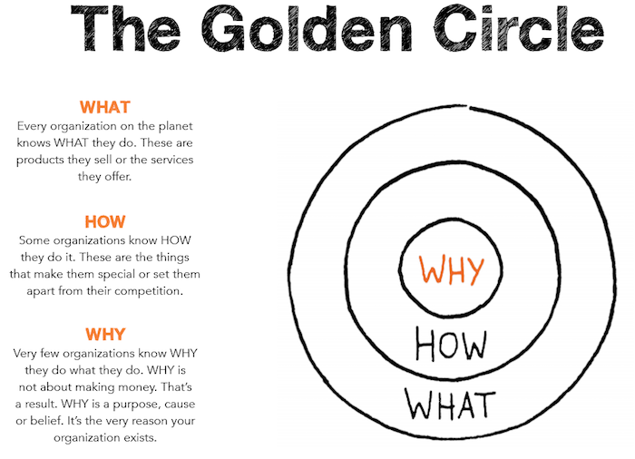

# Find Your Why - Notes and Homework

After reading [Find Your Why](https://www.amazon.com/Find-Your-Why-Practical-Discovering/dp/0143111728) by Simon Sinek, it left me motivated to discover my **WHY**. This repo is a collection of my notes and homework that I used to help discover my **WHY**.

## Literature Overview

All businesses, organizations, and careers operate on three levels: (1) **WHAT** we do, (2) **HOW** we do it, and (3) **WHY** we do it.

We’re all acquainted with **WHAT** we do—the products we sell, the services we offer, the jobs we do. A few of us know **HOW** we do it—the things we think differentiate us or make us unique compared to the rest of the crowd, or our competition. But only a handful of us can clearly articulate **WHY** we do what we do...

Our **WHY** is the purpose, the cause, or the belief that drives every organization and every person’s individual career.

* WHY does your company exist?
* WHY did you get out of bed this morning?
* And WHY should anyone care?

Your **WHY** is what sets you apart from everyone else. It’s your purpose. It’s what inspires you to take action. Your **WHY** is also what inspires others to take action, spread your ideas, or buy your products.

## How I Found My Why

Your WHY Statement is the most effective possible way in which you can articulate your WHY—your purpose... Not just to other people, but to yourself as well.

Your WHY Statement should be:

* Simple and Clear
* Actionable
* Focused on how you’ll contribute to others, and
* Expressed in affirmative language that resonates with you

Your WHY statement should be able to encapsulate all of the qualities we just mentioned—and it should be able to do so in a single sentence.

It should also be “evergreen,” meaning that it should be applicable to everything you do, both personally and professionally.

### Individual Discovery Process

Steps go here

_TODO: Finish steps below_
1) Lorem ipsum dolor sit amet
2) Consectetur adipiscing elit
3) Cras fermentum dolor sapien
4) Vel sollicitudin augue lobortis ut
5) Etiam rhoncus volutpat
6) Consectetur adipiscing elit
7) Lorem ipsum dolor sit amet

### Selection of a Partner

#### Why is a partner needed?
You'll need someone who'll push you to think beyond the surface, to go out of your comfort zone and uncover the memories and experiences that are the source of your WHY. Most 'Significant Others' will be too supportive, and not be able to voice an objective view.

#### What makes a good partner?
You'll want to look for someone close enough to share significant stories from your past and not be embarrassed with. Someone that would be hearing the stories probably hearing these stories for the first time and have an objective voice.

#### Where and When?
Your interview should be conducted in an area free from distractions and both partners should respect the 'Do Not Disturb' options on their phones. I would suggest the requestor bring the interviewer's favorite beverage to this meeting. An average discovery should plan on around three hours.    
**Locations to avoid**: Starbucks, Malls, Bars    
**Preferable**: Your house (with beer!)

## WHY Statement Format

Ultimately you want to come up with a statement that illustrates two major pieces: **Contribution** and **Impact**

    "TO _ _ _ _ SO THAT _ _ _ _ "

The first blank represents your contribution — the contribution you make to the lives others through your **WHY**. And the second blank represents the impact of your contribution.

Your job is to plug-in the blanks to create your own unique WHY Statement.

### Example Statements
Here’s how Simon Sinek, one of the co-authors of this book, expresses his **WHY**:

    “To inspire people to do the things that inspire them so that, together, we can change our world.”

**The impact** Simon wants is for each of us to change the world, in however way we can, for the better.

**The contribution** portion `to inspire people` is what ties it all together, bringing focus and direction to the impact he wants to make on the world. Simon’s contribution is essentially WHAT he does (to make his **WHY** a reality). The books he writes, the workshops he conducts, and the speeches he gives are all part of WHAT he does to move his cause forward—to inspire people to do what inspires them.

And the more he inspires people to do what inspires them, the more of an impact he has towards making the world a better place.

## References

* [How to Find Your Why and Communicate Your Purpose](https://www.deanbokhari.com/find-your-why/)
* [Find Your Why: A Practical Guide for Discovering Purpose for You and Your Team](https://www.amazon.com/Find-Your-Why-Practical-Discovering/dp/0143111728)
* [Start With Why: How Great Leaders Inspire Everyone to Take Action](https://www.amazon.com/Start-Why-Leaders-Inspire-Everyone/dp/1591846447/ref=sr_1_3?ie=UTF8&qid=1547786185&sr=8-3&keywords=find+your+why)
* [TED Talks: How great leaders inspire action](https://www.ted.com/talks/simon_sinek_how_great_leaders_inspire_action?language=en)
* [TED Talks: Why good leaders make you feel safe](https://www.ted.com/talks/simon_sinek_why_good_leaders_make_you_feel_safe)
