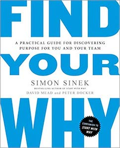

# Find Your Why - Notes and Homework
_A practical guide for discovering purpose for you and your team._

 

After reading this Simon Sinek's **[Find Your Why](https://www.amazon.com/Find-Your-Why-Practical-Discovering/dp/0143111728)**, it left me motivated to **discover my why**. This repo is a collection of my notes and homework that I used to help discover my why.

## Literature Overview

Simon Sinek is a business author and motivational speaker. He has given lectures at The UN Global Compact Leaders Summit, and multiple [TED Talks](https://www.ted.com/talks?sort=newest&q=simon+sinek). **Find Your Why** is a follow up to his book **[Start With Why](https://www.amazon.com/Start-Why-Leaders-Inspire-Everyone/dp/1591846447/ref=sr_1_3?ie=UTF8&qid=1547786185&sr=8-3&keywords=find+your+why)** where Simon illustrates **The Golden Circle**.

## How I Found My Why

The reason you want to find your individual why is because....    
Lorem ipsum dolor sit amet, consectetur adipiscing elit. Quisque quis tortor vel est vulputate facilisis. Integer ornare tellus sed ipsum placerat vehicula. Duis sed congue odio. Vivamus id metus eget nibh venenatis euismod. Ut at interdum leo. Ut laoreet est nec dui vehicula, ac congue magna vestibulum. Pellentesque habitant morbi.

### Selection of a Partner

#### Why is a partner needed?
Lorem ipsum dolor sit amet, consectetur adipiscing elit. Cras fermentum dolor sapien, vel sollicitudin augue lobortis ut. Etiam rhoncus volutpat.

#### What makes a good partner?
Lorem ipsum dolor sit amet, consectetur adipiscing elit. Cras fermentum dolor sapien, vel sollicitudin augue lobortis ut. Etiam rhoncus volutpat.

### End Result

Ultimatly you want to come up with a statement that illustrates two major pieces:

* Contribution
* Impact

Statement Template:

    "TO _ _ _ _ SO THAT _ _ _ _ "
