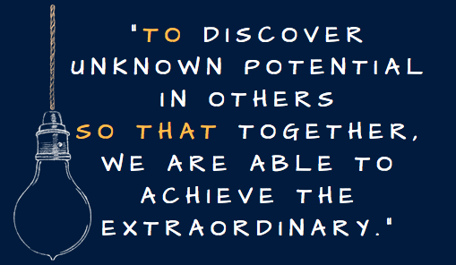

# Why Statement draft

Ultimately you want to come up with a statement that illustrates two major pieces: **Contribution** and **Impact**

    "TO _ _ _ _ SO THAT _ _ _ _ "

The first blank represents your contribution — the contribution you make to the lives others through your **WHY**. And the second blank represents the impact of your contribution.

Your job is to plug-in the blanks to create your own unique WHY Statement.

## Partner Review - Steven

    Date: 21 Jan, 2019
    Partner: Steven Maicach
    Location: His house

### Steven's thoughts [rough-draft]

* kept coming back to Pushing people for greater potential
* Push a team full of people
* have vision and have people march toward it
* get people to share your ideas
  * Idea inception
  * idea adoption
* Looking for efficiencies of day to day
* Stick to your gut
* Vision

### Friend's Exercise

    "Why are you friends with me?""

* outlook on life
* help each other out
* good listener
* able to talk about things with you
* head screwed on shoulders
* never took advantage of other people

## My WHY Statement Discovery

Threads from my user stories as told by Steven

### My Contributions

* Push others
* **Inspire individuals with unknown potential**
* Build potential
* Lead by example
* Take one for the team

### The Impact

* Develop new tools
* Bloom beyond expectations
* **Capitalize and flourish beyond their imagine**

### My WHY Statement

"~**TO** uncover individual's unknown potential **SO THAT** They are able to do achieve their unimaginable.~"

* too many words starting with 'un'

"~**TO** inspire individual's unknown potential **SO THAT** They are able to do achieve their unimaginable.~"    
"~**TO** reveal an individual's unknown potential **SO THAT** they are able to achieve their extraordinary.~"

* feels like it focused on a single individual, rather than a group setting

"**TO** discover unknown potential in others **SO THAT** together, we are able to achieve the extraordinary"

* This feels like more of an individual / group statement. 

