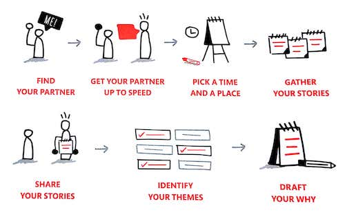

# Find Your Why - Notes

## Discover Your WHY - Chapter Two

### Basic steps to discover WHY

1) Gather Stories

_TODO: Define what a good story looks like_

2) Identify Themes

    This is called the 'Golden Thread' of your story

_TODO: Better Summary for Themes_

3) Draft and Refine a WHY Statement

    Your WHY Statement is the most effective possible way in which you can articulate your WHY—your purpose... Not just to other people, but to yourself as well.

Your WHY Statement should be:

* Simple and Clear
* Actionable
* Focused on how you’ll contribute to others, and
* Expressed in affirmative language that resonates with you

Your WHY Statement will follow this format:

    TO _ _ _ _ _ SO THAT _ _ _ _ _ .

The first blank will be filled with a **CONTRIBUTION** or action statement. "What do you want to do...?"

The second section will be an **IMPACT** that you're actions will result in. "Whats the ultimate result you want to see?"

## WHY Discovery for Individuals - Chapter Three

Finding an Individual Discovery works best if you're prepared. The below diagram outlines the process from a high level.

### Story-Gathering - Peaks and Valleys Method

Draw a horizontal line across the middle of a piece of paper. Happier memories go above the line, and challenging memories go below the line. Hopefully you'll end up with memories on both sides of the spectrum. As you dive into peer review statement focus on the ones on the higher end of the spectrums and if time allows, then cover the ones that are closer to the middle.

