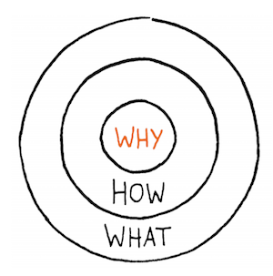

# Find Your Why - Notes

## Start With Why - Chapter One

All businesses, organizations, and careers operate on three levels: (1) **WHAT** we do, (2) **HOW** we do it, and (3) **WHY** we do it.

We’re all acquainted with **WHAT** we do—the products we sell, the services we offer, the jobs we do. A few of us know **HOW** we do it—the things we think differentiate us or make us unique compared to the rest of the crowd, or our competition. But only a handful of us can clearly articulate **WHY** we do what we do...

### An Example Pitch with WHY

Most sales pitches start with **WHAT** the company produces and explains their proprietary differences of **HOW** they produce their product.

    "We sale paper. We Offer the highest quality product at the best possible price. Lower than any of our competitors. Wanna buy some?"

Although this may sale a few units, it does not build loyalty with the consumer. Once another product offers a better price, that customer will migrate. Let's try the sales pitch again with **WHY** in the beginning.

    "What is an idea if it can't be shared? Our company was founded to help spread ideas. The more ideas that are shared, the greater the likelihood those ideas will have an impact in the world. There are many ways to share ideas; one is the written word. That's where we come in. We make paper for those words. We make paper for big ideas. Wanna buy some?"

The customer's that you acquire with your **WHY** will be customer's for much longer because, they too, believe in your cause.

#### An Example From Our History

Let's revisit our brief past. Look at the Railroad companies from the 19th to 20th centuries: At the time when traveling across the country was only feasible via a passenger train. There were so many companies that were developing the rails, cars, it was a BOOMING business. A company during those days that was dedicated toward railway development was sure to go far. Once another transportation method (Airlines) was introduced into the market, consumers flocked to the newer / faster. This shift caused many railroad companies to file for bankruptcy due to their business model focused on railroad development. If we were to revisit with **WHY** and have a company's focus on **Mass Transit Transportation** rather than railroad, that company could have shifted with the times. That company's propose would be evergreen and grow, unbound by technology. 

## Discover Your WHY - Chapter Two

### Basic steps to discover WHY

1) Gather Stories

_TODO: Define what a good story looks like_

2) Identify Themes

    This is called the 'Golden Thread' of your story

_TODO: Better Summary for Themes_

3) Draft and Refine a WHY Statement

    Your WHY Statement is the most effective possible way in which you can articulate your WHY—your purpose... Not just to other people, but to yourself as well.

Your WHY Statement should be:

* Simple and Clear
* Actionable
* Focused on how you’ll contribute to others, and
* Expressed in affirmative language that resonates with you

Your WHY Statement will follow this format:

    TO _ _ _ _ _ SO THAT _ _ _ _ _ .

The first blank will be filled with a **CONTRIBUTION** or action statement. "What do you want to do...?"

The second section will be an **IMPACT** that you're actions will result in. "Whats the ultimate result you want to see?"

## WHY Discovery for Individuals - Chapter Three

Finding an Individual Discovery works best if you're prepared. The below diagram outlines the process from a high level.

### Story-Gathering - Peaks and Valleys Method

Draw a horizontal line across the middle of a piece of paper. Happier memories go above the line, and challenging memories go below the line. Hopefully you'll end up with memories on both sides of the spectrum. As you dive into peer review statement focus on the ones on the higher end of the spectrums and if time allows, then cover the ones that are closer to the middle.

